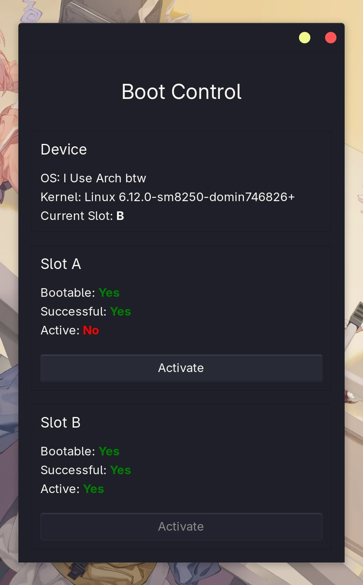

# QBootControl GUI



**QBootControl** is a simple GUI frontend for [`qbootctl`](https://github.com/your-repo/qbootctl), allowing you to easily toggle the active Android boot slot from a graphical interface.

---

## Features

- View current boot slot
- Toggle between A/B slots
- Minimal and clean GTK-based UI

---

## Build Instructions

### Dependencies

Before building, ensure the following dependencies are installed:

- GTK 3 development package
- CMake
- PkgConfig
- Standard build tools (`make`, `gcc`, etc.)
- Linux kernel headers

#### 🐧 Arch Linux / Manjaro

```bash
sudo pacman -S gtk3 cmake base-devel pkgconf linux-headers
```

#### 🐧 Ubuntu / Debian
```bash
sudo apt update
sudo apt install libgtk-3-dev cmake build-essential pkg-config linux-headers-$(uname -r)
```

#### 🐧 PostmarketOS / Alpine Linux
```bash
sudo apk add gtk+3.0-dev cmake build-base pkgconf linux-headers
```

### Build Steps

```bash
git clone https://github.com/khairul169/qbootctrl-gui.git
cd qbootctrl-gui
mkdir build && cd build
cmake ..
make
```

### Installation

To install the app system-wide:

```bash
sudo make install
```

This will install the binary and desktop entry to the appropriate locations.

### Uninstall

To remove the installed files:

```bash
sudo make uninstall
```

## Credits

Huge thanks to the original contributor of [qbootctl](https://github.com/linux-msm/qbootctl) for porting it from the AOSP source. Your work made this tool possible.

Special appreciation to [rmux](github.com/rmuxnet) for the valuable help and guidance about this tool.

Gratitude also goes out to the awesome folks in the Xiaomi Pad 6 Mainline Linux Telegram group for sharing insights, feedback, and support along the way.

Telegram group: t.me/pipa_mainline


## License

This project is licensed under the [GNU General Public License v3.0](LICENSE).
